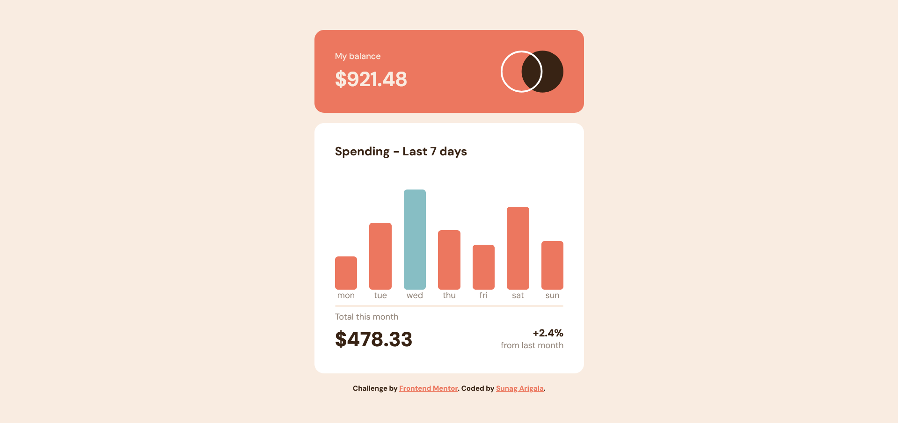
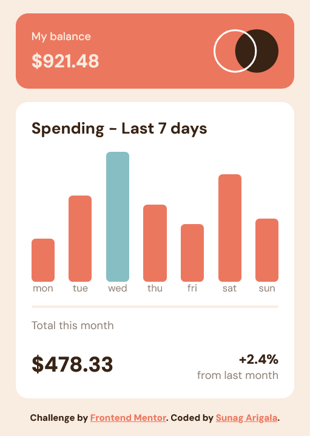

# Expenses-chart-component
HTML-CSS-JavaScript
# Frontend Mentor - Expenses chart component solution

This is a solution to the [Expenses chart component challenge on Frontend Mentor](https://www.frontendmentor.io/challenges/expenses-chart-component-e7yJBUdjwt). Frontend Mentor challenges help you improve your coding skills by building realistic projects. 

## Table of contents

  - [The challenge](#the-challenge)
  - [Screenshot](#screenshot)
  - [Links](#links)
  - [Built with](#built-with)
  - [What I learned](#what-i-learned)

## Overview

### The challenge

Users should be able to:

- View the bar chart and hover over the individual bars to see the correct amounts for each day
- See the current day’s bar highlighted in a different colour to the other bars
- View the optimal layout for the content depending on their device’s screen size
- See hover states for all interactive elements on the page
- **Bonus**: Use the JSON data file provided to dynamically size the bars on the chart

### Screenshot





### Links

- Solution URL:([https://your-solution-url.com](https://github.com/911Sunag/Expenses-chart-component))

### Built with

- Semantic HTML5 markup
- CSS custom properties
- Flexbox
- CSS Grid
- Mobile-first workflow

### What I learned


```html
<div class="box"></div>
```
```css
.box {
  display: flex;
  justify-content: space-between;
  align-items: flex-end;
  height: 200px;
  margin-top: 1rem;
}

.bar-container {
  display: flex;
  flex-direction: column;
  align-items: center;
  position: relative;
}

.bar {
  width: 35px;
  background-color: var(--Red500);
  border-radius: 5px;
  cursor: pointer;
}
.bar:hover{
  background-color: hsl(10, 73%, 75%);
}

.bar.max {
  background-color: var(--Blue300);
}
.bar.max:hover{
   background-color:hsl(186, 66%, 78%) ;
}

.tooltip {
  position: absolute;
  top: -30px;
  background-color: var(--Brown950);
  color: white;
  padding: 5px 7px;
  border-radius: 5px;
  font-size: 12px;
  opacity: 0;
  transform: translateY(10px);
  pointer-events: none;
  transition: 0.2s;
}

.bar-container:hover .tooltip {
  opacity: 1;
  transform: translateY(0);
}
```
```js
fetch("data.json")
  .then(res => res.json())
  .then(data => {
    const box = document.querySelector(".box");
    const maxAmount = Math.max(...data.map(d => d.amount));
    data.forEach(day => {
      const barContainer = document.createElement("div");
      barContainer.classList.add("bar-container");
      const bar = document.createElement("div");
      bar.classList.add("bar");
      bar.style.height = (day.amount * 3) + "px";

      if (day.amount === maxAmount) {
        bar.classList.add("max");
      }
      const tooltip = document.createElement("span");
      tooltip.classList.add("tooltip");
      tooltip.textContent = `$${day.amount}`;

      const label = document.createElement("small");
      label.textContent = day.day;

      barContainer.appendChild(tooltip);
      barContainer.appendChild(bar);
      barContainer.appendChild(label);

      box.appendChild(barContainer);
    });
  });
```


## Author
- Frontend Mentor - [@911Sunag](https://www.frontendmentor.io/profile/911Sunag)
